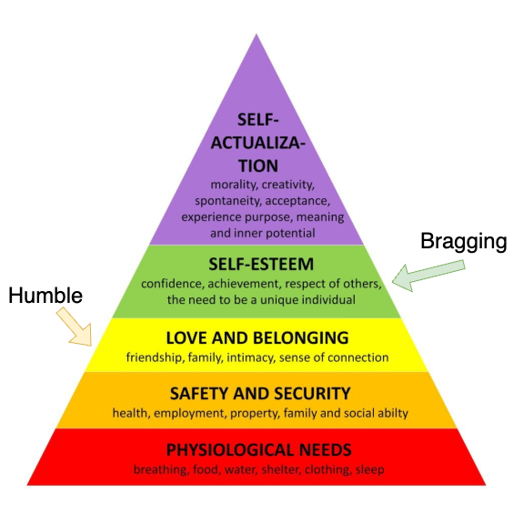

# নমস্কার | नमस्ते | Namaste | 🙏

Welcome to my homepage! I am a second year PhD student in the Computer Science and Engineering Department of [IIT Bombay](https://www.iitb.ac.in/). I am on study leave from my Lecturer position in Information Technology at [Government Polytechnic Daman](https://gpdaman.in/). I was selected for the Lecturer position through [UPSC](https://www.upsc.gov.in/). Prior to that, I worked as an Assistant Professor at [Sikkim Manipal Institute of Technology](https://smu.edu.in/smit.html/). During my M.Tech. I worked on an industry sponsored project on Sentiment Analysis at [Indian Statistical Institute, Kolkata](https://www.isical.ac.in/). I completed my Bachelors and Masters from [Assam University, Silchar](http://www.aus.ac.in/).

My research focuses on various aspects of computational linguistics. In the past, I have worked on scholarly document processing, legal document processing, novelty detection, sentiment analysis and dialogue summarization. For my PhD, I am working on NLP for mental health.

In my free time, I love to travel and take photographs (see my Instagram profile). On social media, I am most active on LinkedIn and least active on Facebook.

# News
- May 2025: Our Humblebragging paper got accepted to ACL 2025 Findings
- Apr 2025: Shortlisted for attending MLSS 2025 to be held at Dakar, Senegal
- Mar 2025: Shortlisted for attending MLSS^D 2025 to be held at Krakow, Poland
- Dec 2024: Received ACM travel grant for attending PIC 2025 at Mysore, India
- Nov 2024: Selected as CFILT Lab's SPOC for TechConnect 2024 at IIT Bombay
- Sep 2024: Received travel grant for attending IndoML 2024 at Goa, India

# PhD Journey
## Fourth Semester (Spring 2024-25)

Our paper on Humblebragging got accepted to ACL 2025 Findings:

Read the [paper here](https://aclanthology.org/2025.findings-acl.198.pdf).

Attended Pingala Interactions in Computing 2025 at Mysore, India and had a lot of fun:

## Third Semester (Autumn 2024-25)

I am fortunate to have registered under the supervision of [Prof. Pushpak Bhattacharyya](https://www.cse.iitb.ac.in/~pb/) and [Prof. Biplab Banerjee](https://biplab-banerjee.github.io/).

Attended IndoML 2024 at Goa, India:

## Second Semester (Spring 2023-24)

In the second semester I took the following course:

| Course Name                                            | Code        | Professor                   |
| --------------------------------------------------     | ----------- | ----------------------------|
| Deep Learning for Natural Language Processing          | CS 772      | Pushpak Bhattacharyya       |

## First Semester (Autumn 2023-24)

I had taken the following courses for my coursework in the first semester:

| Course Name                                            | Code        | Professor                   |
| --------------------------------------------------     | ----------- | ----------------------------|
| Speech and Natural Language Processing and the Web     | CS 626      | Pushpak Bhattacharyya       |
| Information Retrieval & Mining for Hypertext & the Web | CS 635      | Soumen Chakraborty          |
| Foundations of Machine Learning                        | CS 725      | Sunita Sarawgi              |

